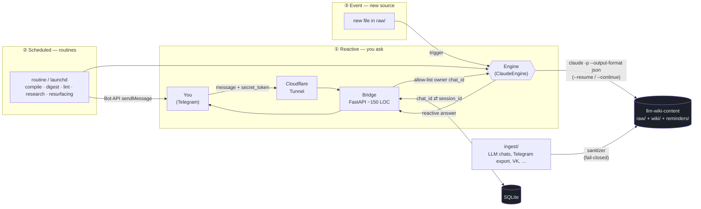

# personal-llm-wiki — «Второй мозг»

> A personal AI assistant built as a **persistent, interlinked Markdown wiki** that an LLM agent maintains incrementally — Andrej Karpathy's LLM-wiki pattern. **No vector DB. No embedder.** A subscription-CLI agent (**Claude Code**, the official `claude` binary) does the semantic ranking by reading the wiki, runs across **three execution layers** (reactive · scheduled · event), a thin Telegram bridge makes it reactive *and* proactive, and a hard two-repo split keeps the framework public while your data stays private. The engine sits behind a portable seam — **Claude-native today**, Grok/Codex are deferred adapter slots.

<p>
  
  
  
  
  
  
  
</p>

> **Русское интро.** «Второй мозг» — это личный ИИ-ассистент, реализованный как **персональная LLM-wiki по паттерну Карпатого**: репозиторий Markdown + git, который инкрементально ведёт **подписочный CLI-агент (Claude Code — официальный бинарь `claude`)** — *без векторной базы и без embedder'а*. Движок работает в **трёх слоях исполнения** (реактивный · плановый · событийный) и спрятан за портируемым швом: Claude-native сегодня, Grok/Codex — отложенные слоты-адаптеры. Интерфейс — **Telegram-бот**: отвечает на вопросы по вашей вики (реактив) и сам присылает напоминания о днях рождения, встречах и идеях (проактив). Сердце вики — **концепции, развитие и идеи** про владельца; код-сессии сжимаются в записи «что я построил», а не verbatim. **Два репозитория**: этот, публичный (только фреймворк + синтетический пример — портфолио), и приватный `llm-wiki-content` (ваши личные данные, никогда не публикуется). Этот README — англоязычный (портфолио), вся проектная документация — на русском в [`docs/`](docs/).

---

## Why this exists

Most "chat with your notes" tools in 2026 are RAG wrappers: they chunk your documents, embed them into a vector store, and re-retrieve fragments on every question. That buys fuzzy recall at the cost of a vector database, an embedding model, and an opaque pipeline where you can never quite see *what the assistant knows about you*.

**Второй мозг takes the opposite bet — Karpathy's LLM-wiki pattern.** Knowledge is *compiled once* into a human-readable Markdown wiki: the agent reads a new source, updates a handful of entity/concept pages, links them, records contradictions, and appends a line to a changelog. Every change is an ordinary `git diff` you can read, review and revert. Retrieval is just the agent reading `index.md` and following links — the LLM itself does the semantic ranking. For a single user over a few hundred pages this is not a compromise; it is *simpler, fully transparent, and zero-infrastructure*.

Three things make this build different from the rest of the niche:

1. **No embedder, no vector store** — the pure Karpathy pattern, kept honest by an explicit trip-wire ([ADR-0002](docs/adr/0002-no-embedder-pure-karpathy.md)).
2. **Proactive, not just reactive** — a scheduler wakes the engine to read due reminders and *pushes* a digest to you. Most "second brain" tools only answer when spoken to.
3. **Subscription engine, $0 over the bill** — the agent runs on **Claude Code** (the official `claude -p --output-format json` binary) under an already-paid **Claude Max** subscription, behind a portable interface so the engine can be swapped later ([ADR-0008](docs/adr/0008-engine-claude-native.md)). It is invoked *only* through the official binary, never by reusing the OAuth token in a custom HTTP client ([ADR-0009](docs/adr/0009-tos-safe-engine-access.md)).

The result is a system you could actually run for yourself, and a portfolio piece that makes a defensible architectural argument rather than reaching for the default vector DB.

---

## How it works (one picture)



The engine runs across **three execution layers** ([ADR-0008](docs/adr/0008-engine-claude-native.md)):

- **① Reactive (Telegram → bridge → engine).** A message hits the Telegram Bot API, travels through a Cloudflare Tunnel to a tiny FastAPI bridge on your Mac. The bridge validates the webhook secret, **hard-drops anything that is not from your own `chat_id`** (single-user, [ADR-0009](docs/adr/0009-tos-safe-engine-access.md)), then spawns one short-lived `claude -p` (resuming the chat's session via `--resume`) which reads/edits the private wiki and answers. A bare message is *captured* into the wiki; a question is answered from it.
- **② Scheduled (routine / launchd → `claude -p`).** A schedule wakes the engine for routine work: **compile** the wiki overnight, a morning **digest + reminders** sweep, weekly **lint**, planned **web-research**, and **idea-resurfacing**. Locally this is `launchd`; the 24/7 upgrade is **remote Claude routines**, which run even while the Mac is asleep because they operate on the private GitHub repo. (A Telegram bot cannot DM you first — so you send `/start` once, the bridge remembers your `chat_id`, and pushes flow forever.)
- **③ Event (new file in `raw/` → compile).** Dropping a freshly-sanitized source into `raw/` triggers an incremental compile so the wiki stays current without waiting for the nightly routine.
- **Ingest.** Connectors turn your data — **chats from all LLMs** (ChatGPT/Claude/Grok) first, then Telegram export, VK, WhatsApp, YouTube history, X archive — into sanitized Markdown in `raw/`, through a **fail-closed sanitizer** that masks secrets/PII *before* anything is written.

Full diagrams, the sequence flow, the routines layer and the Pachca→Telegram remap live in [`docs/architecture/architecture.md`](docs/architecture/architecture.md).

---

## The engine: Claude-native, $0 over the bill

The agent that maintains the wiki is **Claude Code in headless mode** — the **official `claude` binary**, invoked as `claude -p "<prompt>" --output-format json` (parse the JSON for the result text + session id; resume a conversation with `--resume <id>` or `--continue`). It authenticates through an already-paid **Claude Max** subscription rather than a per-token API key. Within the subscription's limits, running the assistant costs **$0 on top of the bill you already pay** — the core workload is agentic file-editing of dozens of Markdown pages, exactly what this CLI is good at. Claude covers all three roles this system needs: the interactive brain (Telegram reactive), the "hands" (web/computer agent via MCP), and the wiki compiler (scheduled routines). Rationale is in [ADR-0008](docs/adr/0008-engine-claude-native.md) (which **supersedes the original Codex decision, [ADR-0001](docs/adr/0001-engine-subscription-codex.md)**).

**ToS-safe by construction.** The engine is reached *only* through the official binary, never by scraping or reusing the subscription OAuth token inside a custom/third-party HTTP client — that is exactly the pattern Anthropic blocked in early 2026 (the banned "OpenClaw" route). The bridge is **single-user**: it hard allow-lists the owner's Telegram `chat_id` and drops everything else, keeping the system squarely inside "ordinary individual use" ([ADR-0009](docs/adr/0009-tos-safe-engine-access.md)). Note on cost: from **2026-06-15**, scripted Claude Code / Agent SDK use on a subscription draws from a monthly **Agent-SDK credit** (~$100/mo on Max-5x, per user); generous for personal scale, overage at API rates.

**Engine-portable seam.** The engine sits behind a one-function abstraction — `run_engine(prompt, session_id | None) -> (answer, new_session_id, usage)` — with an abstract `Engine` base and **`ClaudeEngine` as the default**. Two **deferred adapter slots** ship alongside it, added by config without rewriting the bridge: **`CodexEngine`** (`codex exec`, the portable fallback) and **`GrokEngine`** (backends: `grok -p --output-format json` via grok-build-cli, or OpenClaw — which is sanctioned by xAI for Grok **only**, never for Claude, per [ADR-0009](docs/adr/0009-tos-safe-engine-access.md)). Grok is intended as an optional later *advisor voice* for A/B life-advice. The pattern is **spawn-fresh-per-task**: one short-lived process per message, routine or event — never a resident daemon (this sidesteps the live-session-dies-on-token-expiry class of bug). Spawn/scheduler details are in [ADR-0007](docs/adr/0007-engine-spawn-and-scheduler.md).

---

## Two repos: a hard public/private boundary

The project is split across **two git repositories** so that the framework can be fully open while your personal data is structurally incapable of leaking ([ADR-0003](docs/adr/0003-two-repos-public-private.md)):

| Repo | Visibility | Contents |
|---|---|---|
| **`personal-llm-wiki`** (this) | public | Framework only: the compiler contract, the bridge code, ingest scripts, the scheduler, concept docs, a **synthetic example wiki**, README/SETUP. Zero personal facts, zero secrets, zero real contacts. This is the portfolio. |
| **`llm-wiki-content`** | private | Your data: `raw/` (immutable sanitized snapshots), `wiki/` (pages about you), `reminders/`. Secrets only in `.env` (gitignored). |

The boundary is enforced in depth: a **fail-closed sanitizer** on the write-path masks secrets/PII before anything lands in `raw/`, and [`scheduler/lint_public.py`](scheduler/) scans the public repo for secret/PII patterns and exits non-zero on a hit (CI gate). Every example in this repo is synthetic and clearly labelled — see [`wiki-example/`](wiki-example/), populated with obviously-fake names like *Иван Пример*.

---

## Content model: a brain about you, not a code archive

The wiki is a "second brain" *about the owner*, so its heart is **concepts, personal development and ideas** — not API docs ([ADR-0010](docs/adr/0010-wiki-content-model.md)). The technical layer is kept **strong but compressed and secondary**:

- **Page types** — `ideas/` · `concepts/` · `growth/` · `people/` · `projects/` (accomplishment records) · `capability-profile` (a derived "what I can do" page) · `journal/`.
- **Code sessions → accomplishment, not verbatim.** A coding chat is distilled into *what was built* ("built X with Y, demonstrates skill Z, key decisions/lessons") and rolled up into the `capability-profile`. Full technical detail stays in `raw/`; the wiki carries the summary.
- **Ingest chats from all LLMs, incrementally.** Sources are notes plus exported conversations from **every** LLM (ChatGPT/Claude/Grok), pulled in continuously by a watermark cursor, then messengers later.

---

## Quickstart

> v1 runs on **macOS** and is written host-portable for a later Mac Mini / VPS ([ADR-0005](docs/adr/0005-host-v1-macbook-portable.md)). The setup is genuinely interactive (subscription login, Telegram bot creation, tunnel auth) and cannot be fully automated — so it lives as a runbook, not a script.

Follow **[`setup/SETUP.md`](setup/SETUP.md)** end to end. In short:

1. **Install** the toolchain — `brew install gh cloudflared` plus the official `claude` CLI, Python 3.11+.
2. **Authenticate the engine** — log in to **Claude Code** under your Claude Max subscription (the official binary; never expose the OAuth token to a custom client — [ADR-0009](docs/adr/0009-tos-safe-engine-access.md)), and review your data/privacy controls *before* your first ingest.
3. **Create the bot** — talk to `@BotFather`, get the token, send `/start` once to capture your owner `chat_id`.
4. **Configure** — copy `.env.example` to `.env` in both repos and fill the placeholders (bot token, owner chat id, webhook secret, repo paths).
5. **Run the bridge** — start the FastAPI app and a `cloudflared` tunnel; point the Telegram webhook at it.
6. **Load the routines** — `launchctl load` the digest-sweep and lint agents locally; optionally promote them to remote Claude routines for 24/7 operation on the private repo.
7. **First ingest** — run an `ingest/` connector (LLM-chat export first, then a Telegram Desktop `result.json`) and watch the engine compile it into your private wiki.

The synthetic [`wiki-example/`](wiki-example/) lets you read the page format and the "agent maintains a wiki" git history *without any setup at all*.

---

## Repository map

```
personal-llm-wiki/
├── README.md                 ← you are here (portfolio-facing, English)
├── LICENSE                   MIT
├── CONTEXT.md                living project context: scope, invariants, terminology
├── CLAUDE.md                 the compiler schema the engine reads (AGENTS.md mirror)
├── AGENTS.md                 engine-agnostic mirror of the compiler schema
├── compiler/
│   └── rules.md              the wiki-maintenance contract: page format, frontmatter,
│                             ingest/query/lint workflows, sanitizer rules, writeback
├── bridge/                   Telegram ⇄ engine FastAPI bridge
│                             webhook + HMAC validation + owner-chat allow-list,
│                             SQLite chat_sessions, engine-portable runner
│                             (ClaudeEngine default; Grok/Codex deferred slots),
│                             Bot API client, /health, structlog, launchd .plist
├── ingest/                   data → sanitized Markdown
│                             sanitizer.py (SHARED: secret/PII masking),
│                             llm_chat.py (ChatGPT/Claude/Grok exports), telegram_export.py,
│                             watermark.py, connector stubs: vk / whatsapp / youtube_takeout / x_archive / codebase_graphify
├── scheduler/                scheduled routines (digest/reminder sweep, compile, web-research,
│                             idea-resurfacing) + lint_public.py (PII/secret gate), launchd .plist files
├── wiki-example/             SYNTHETIC example wiki (all fake, clearly labelled)
│                             index.md, log.md, concepts/, ideas/, growth/, people/,
│                             projects/, capability-profile, reminders/
├── setup/SETUP.md            interactive activation runbook
└── docs/
    ├── adr/                  architecture decision records (0001–0010)
    ├── architecture/         architecture.md — diagrams, data-flow, threat model
    └── research/             the pre-build research report (7 directions)
```

---

## Design decisions

Decisions are captured as **ADRs** — short, dated, not rewritten (superseded if reversed). They are the spec the build follows; start with [`CONTEXT.md`](CONTEXT.md) for the living overview, then:

| ADR | Decision |
|---|---|
| ~~[0001](docs/adr/0001-engine-subscription-codex.md)~~ | ~~**Engine** = subscription Codex CLI~~ — **superseded by [0008](docs/adr/0008-engine-claude-native.md)** (Claude-native v1; Codex kept only as a deferred adapter). |
| [0002](docs/adr/0002-no-embedder-pure-karpathy.md) | **No embedder, no vector store** — pure Karpathy Markdown wiki; lexical SQLite FTS5 *later* if needed, never vectors. |
| [0003](docs/adr/0003-two-repos-public-private.md) | **Two repos** — public framework vs private content; the hard "code ≠ data" boundary. |
| [0004](docs/adr/0004-telegram-bridge-reactive-proactive.md) | **Interface** = a Telegram bridge, reactive *and* proactive. |
| [0005](docs/adr/0005-host-v1-macbook-portable.md) | **Host v1** = the current MacBook, code written host-portable. |
| [0006](docs/adr/0006-github-account-kengston.md) | **GitHub account / repo creation** workflow. |
| [0007](docs/adr/0007-engine-spawn-and-scheduler.md) | **Spawn-fresh-per-task**, idempotent scheduled sweep, the `reminders` file format, and explicit ToS / prompt-injection risk acceptance. |
| [0008](docs/adr/0008-engine-claude-native.md) | **Engine = Claude-native** (official `claude` binary), engine-portable; Grok/Codex are deferred adapter slots. **Supersedes [0001](docs/adr/0001-engine-subscription-codex.md).** |
| [0009](docs/adr/0009-tos-safe-engine-access.md) | **ToS-safe engine access** — official binary only, single-user owner allow-list, never reuse the OAuth token in a third-party client; Agent-SDK credit from 2026-06-15. |
| [0010](docs/adr/0010-wiki-content-model.md) | **Content model** — concepts/development/ideas first; code sessions compressed into accomplishment/capability records; ingest chats from all LLMs. |

---

## Research

Before a line of code was written, the locked decisions were stress-tested against 2026 external sources across seven directions — engine runtime, memory architecture, the Telegram interface, proactive scheduling, data ingestion, privacy/security, and portfolio positioning. The synthesis (with per-direction deep-dives and a full source list) is in **[`docs/research/`](docs/research/README.md)**. Headline: the research confirmed the memory/interface/scheduling/privacy decisions and surfaced the new ones in [ADR-0007](docs/adr/0007-engine-spawn-and-scheduler.md); a later round of grilling on the engine itself produced the **Claude-native pivot** ([ADR-0008](docs/adr/0008-engine-claude-native.md)–[0010](docs/adr/0010-wiki-content-model.md)).

---

## Non-goals & limitations (honest)

- **Single user.** This automates *one person's own account on their own machine* — it is not a multi-tenant SaaS.
- **Local v1 is Mac-only and not 24/7.** With local `launchd`, proactive pushes arrive only while the MacBook is awake (it catches sleep but not power-off). The 24/7 upgrade is **remote Claude routines**, which run independently of the Mac because they operate on the private GitHub repo ([ADR-0005](docs/adr/0005-host-v1-macbook-portable.md)).
- **Subscription automation has guardrails.** It is permitted because the engine is the **official `claude` binary** in single-user "ordinary individual use" — not a grey area, but bounded: never reuse the OAuth token in a custom client, keep schedules modest, and from 2026-06-15 scripted use draws on the monthly Agent-SDK credit ([ADR-0009](docs/adr/0009-tos-safe-engine-access.md)).
- **It is a textbook "lethal trifecta."** Private data + untrusted ingested content + an outbound channel. There is no 100% defence against prompt-injection; the mitigation is blast-radius minimisation (least-privilege sandbox, a single narrow Telegram push channel, no generic "fetch any URL" tool). See [`docs/research/privacy-security.md`](docs/research/privacy-security.md).
- **Consumer subscriptions are not private by default.** Provider data/retention policies vary, so the setup runbook makes reviewing them an early step, and crown-jewel secrets never go into wiki prose regardless of engine.

---

## Acknowledgements

The pattern is **[Andrej Karpathy's LLM-wiki](https://gist.github.com/karpathy/442a6bf555914893e9891c11519de94f)** idea, with a nod to Vannevar Bush's *Memex* (1945). The implementation conventions — frontmatter, relative-link wiki pages, `index.md` + append-only `log.md`, the sanitizer-in-write-path, the ADR format — are adapted from the author's corporate LLM-wiki, and the Telegram bridge re-maps a proven `pachca-codex-bridge` design.

## License

[MIT](LICENSE) © 2026 Kengston.
