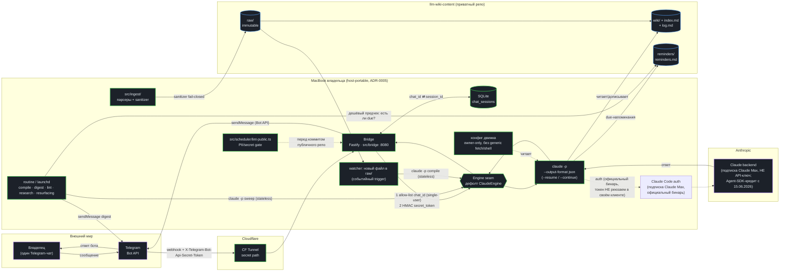
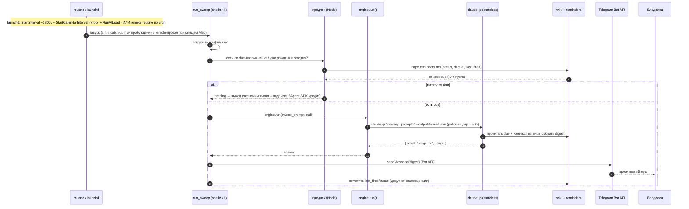
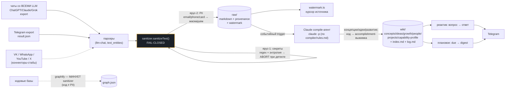
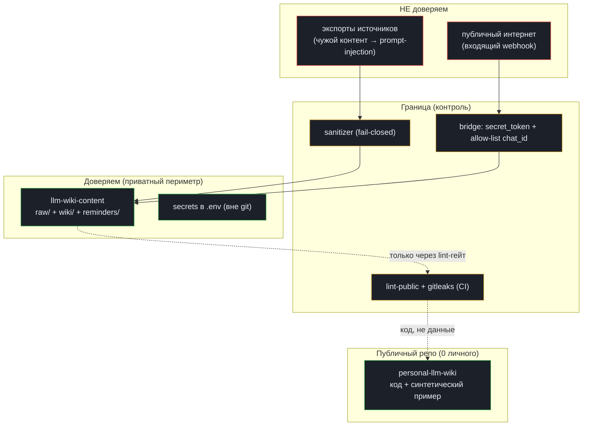

# Архитектура — «Второй мозг»

> Целевая архитектура личной LLM-wiki: компоненты, **три слоя исполнения** (реактив · плановое · событийное), поток одного сообщения, проактивный sweep, путь данных от источника до Telegram и модель угроз. Это **ремап** проверенного плана `pachca-codex-bridge-plan` (Pachca → bridge → агент) на личный сценарий: тот же тонкий мост, но движок — **Claude-native** (официальный бинарь `claude`, [ADR-0008](../adr/0008-engine-claude-native.md)), backend — не корпоративный `abcage-mcp-hub`, а **личная вики + reminders**, и добавлен **проактив**.
>
> Инварианты и терминология — в [CONTEXT.md](../../CONTEXT.md). Решения, на которые опирается эта страница, — в [docs/adr/](../adr/) ([0008](../adr/0008-engine-claude-native.md)/[0009](../adr/0009-tos-safe-engine-access.md)/[0004](../adr/0004-telegram-bridge-reactive-proactive.md)/[0007](../adr/0007-engine-spawn-and-scheduler.md); движок-решение [0008](../adr/0008-engine-claude-native.md) **supersedes** [0001](../adr/0001-engine-subscription-codex.md)). Внешнее обоснование деталей — в [docs/research/](../research/README.md).

## 1. Картина целиком

Система — это **четыре подсистемы** вокруг одного источника истины (личная вики в приватном репо), а движок вызывается из **трёх слоёв исполнения** ([ADR-0008](../adr/0008-engine-claude-native.md)):

```
① ИСТОЧНИКИ (экспорты, read-only)
   чаты со ВСЕМИ LLM · Telegram · VK · WhatsApp · YouTube history · X archive · кодовые базы
        │
        ▼
② ИНГЕСТ И НОРМАЛИЗАЦИЯ  (src/ingest/, по watermark)
   парсеры экспортов → sanitizer (fail-closed) → markdown + provenance
        │
        ▼
③ ИСТОЧНИК ИСТИНЫ  (приватный репо llm-wiki-content)
   raw/ (immutable) · wiki/ (страницы, ведёт LLM) · reminders/ · index.md + log.md
        │                                   ▲
        │ читает/дописывает                 │ push-напоминания
        ▼                                   │
④ ДВИЖОК  (claude -p --output-format json, подписка Claude Max)
   за абстракцией Engine → дефолт ClaudeEngine; Grok/Codex — отложенные слоты
        ▲                  ▲                │
   реактив (--resume)  событийное       плановое (stateless sweep)
   ┌────┴─────────┐    ┌──┴──────────┐  ┌─────┴──────────┐
   BRIDGE (Fastify)    EVENT          SCHEDULER (routine / launchd)
   webhook → ответ     new raw/ → compile   compile · digest · lint · research · resurfacing
        │                  │               │
        ▼                  ▼               ▼
        TELEGRAM-бот «Второй мозг»  (Bot API + CF Tunnel)
```

Три слоя исполнения ([ADR-0008](../adr/0008-engine-claude-native.md)):

- **РЕАКТИВ** — Telegram (owner-only) → bridge → движок → ответ/правка вики.
- **ПЛАНОВОЕ** — routine (remote Claude routine / `launchd`) → `claude -p` → компиляция вики / дайджест+напоминания / lint / web-research / resurfacing идей.
- **СОБЫТИЙНОЕ** — новый source в `raw/` → trigger → инкрементальная компиляция.

Ключевые архитектурные принципы (детали — [ADR-0007](../adr/0007-engine-spawn-and-scheduler.md), [ADR-0008](../adr/0008-engine-claude-native.md), [ADR-0009](../adr/0009-tos-safe-engine-access.md), [research](../research/README.md)):

- **Движок — Claude-native, официальный бинарь** ([ADR-0008](../adr/0008-engine-claude-native.md)). `claude -p "<prompt>" --output-format json` (парсим JSON → текст ответа + session id; продолжение через `--resume <id>` / `--continue`). Claude закрывает три роли: интерактивный мозг (реактив), «руки» (web/computer через MCP), компилятор вики (плановое).
- **ToS-safe by construction** ([ADR-0009](../adr/0009-tos-safe-engine-access.md)). Зовём **только** официальный бинарь, **никогда** не реюзаем OAuth-токен в своём/стороннем HTTP-клиенте (это и есть забаненный паттерн OpenClaw). Bridge — **single-user**: жёсткий allow-list на `chat_id` владельца, всё остальное дропается.
- **Spawn-fresh-per-task.** Все три слоя спавнят ОДИН короткоживущий `claude -p` на задачу — никогда резидентный демон (обходит класс багов «живая сессия умирает на истечении токена»).
- **Движок за абстракцией** `engine.run(prompt, session_id|null): Promise<{ answer, session_id, usage }>` — шов портируемости ([ADR-0008](../adr/0008-engine-claude-native.md)): база `Engine`, дефолт **`ClaudeEngine`**; **`GrokEngine`** (grok-build-cli `grok -p --output-format json` / OpenClaw — допустим только для Grok, не для Claude) и **`CodexEngine`** (`codex exec`) — отложенные слоты-адаптеры, добавляются конфигом.
- **Память — markdown + `index.md`, без embedder** ([ADR-0002](../adr/0002-no-embedder-pure-karpathy.md)). Семантическое ранжирование делает сам LLM-клиент, читая вики.
- **Контент-модель** ([ADR-0010](../adr/0010-wiki-content-model.md)): концепции/развитие/идеи-first; код-сессии → accomplishment/capability-выжимка, не verbatim.
- **Sanitizer — в write-path, fail-closed** ([ADR-0003](../adr/0003-two-repos-public-private.md)). Маскируем секреты/PII ДО записи в `raw/` и ДО любого попадания в публичный репо.
- **Единственный исходящий канал движка — узкий Telegram-пуш владельцу.** Никакого generic «fetch any URL»/shell-инструмента (минимизация blast radius lethal trifecta).

## 2. Компонентная диаграмма

Легенда: <span>🟢 новое (пишем в этом проекте)</span> · <span>🟣 внешние сервисы</span> · <span>🔵 личные данные / состояние</span>.



**Что нового по сравнению с прообразом.** В `pachca-codex-bridge-plan` backend — корпоративный `abcage-mcp-hub` (HTTP MCP-gateway с JWT, role-gate, audit). Здесь его нет: backend движка — **локальная файловая вика** в приватном репо, движок ходит туда напрямую (рабочая директория = приватный репо, write-доступ ограничен им). Зато добавлены целые **плановая** (routines: compile/digest/lint/research/resurfacing) и **событийная** (new raw/ → compile) ветки, которых в корпоративном плане не было.

> **Remote vs local routine.** Локально плановый слой — `launchd` (срабатывает только пока Mac не выключен). Апгрейд к 24/7 — **remote Claude routines**: они исполняются на стороне Anthropic над приватным GitHub-репо, поэтому работают **даже когда Mac спит/выключен** ([ADR-0005](../adr/0005-host-v1-macbook-portable.md)). На диаграмме узел `routine / launchd` — обе реализации одного слоя.

## 3. Поток одного сообщения (реактив)

Адаптация sequence-диаграммы прообраза на Telegram. Главные отличия от Pachca-версии: вместо `X-Pachca-Signature` — `X-Telegram-Bot-Api-Secret-Token`, добавлен **allow-list на `chat_id` владельца**, и вместо вызова MCP-хаба движок читает/пишет **локальную вики**.

```mermaid
sequenceDiagram
  autonumber
  participant U as Владелец
  participant TG as Telegram
  participant T as CF Tunnel
  participant B as Bridge (mac)
  participant D as SQLite
  participant E as engine.run()
  participant C as claude -p
  participant W as wiki (raw/+wiki/)
  participant O as Anthropic (подписка)

  U->>TG: "Когда у Ивана день рождения?" (или заметка)
  TG->>T: POST /tg/<secret> (webhook)
  T->>B: forward
  B->>B: 1) crypto.timingSafeEqual(secret_token)
  B->>B: 2) drop if chat_id != OWNER_CHAT_ID (single-user)
  B->>TG: sendChatAction "typing" + короткий ack
  B->>D: SELECT session_id WHERE chat_id=?
  D-->>B: session_id (или null для первого сообщения)
  B->>E: engine.run(prompt, session_id)
  E->>C: claude -p "<prompt>" --output-format json [--resume <sid>] (рабочая дир = wiki)
  C->>O: auth официальным бинарём (подписка, НЕ API-ключ; токен НЕ реюзаем в своём клиенте)
  Note over C,W: Claude решает: прочитать index.md → нужную страницу
  C->>W: read index.md, people/ivan.md
  W-->>C: содержимое страниц
  alt это заметка, не вопрос
    C->>W: дописать страницу + log.md (git-diff)
  end
  O-->>C: финальный ответ
  C-->>E: JSON: { result: "<текст>", session_id, usage }
  E-->>B: { answer, session_id, usage }
  B->>D: UPSERT chat_id → new_session_id
  B->>TG: sendMessage(answer)
  TG-->>U: ответ в чате
```

Узлы, добытые исследованием (см. [engine-runtime.md](../research/engine-runtime.md), [telegram-interface.md](../research/telegram-interface.md)):

- **Первое сообщение чата — без `--resume`**: парсим `session_id` из JSON-ответа → пишем в SQLite. Дальше — `--resume <session_id>` (или `--continue` для последнего диалога рабочей директории).
- **Ответ — структурированный JSON** (`--output-format json`): берём `result` (текст), `session_id` (для resume) и `usage` (учёт лимитов подписки / Agent-SDK-кредита). Для длинных задач можно `--output-format stream-json` и читать построчно.
- **`sendChatAction "typing"` + короткий ack сразу** маскируют латентность нескольких секунд (cold start `claude` + ризонинг).
- **Single-flight на `chat_id`**, жёсткий timeout (120–240с), один ограниченный retry на transient-ошибке.
- **Spawn-fresh-per-task**: каждый запрос — новый `claude -p`, состояние диалога несёт `--resume <session_id>`, не живой процесс.

## 4. Плановый слой: проактивный sweep и routines

Net-new относительно прообраза — это **плановый слой исполнения** ([ADR-0008](../adr/0008-engine-claude-native.md)). Сюда же кладутся остальные routines (ночная компиляция вики, еженедельный lint, плановый web-research, resurfacing идей) — ниже показан утренний digest-sweep как типовой пример.

**Две реализации одного слоя:**
- **Локально — `launchd` (LaunchAgent), не cron**: при пробуждении из сна launchd запускает пропущенную задачу (cron молча скипает) и **коалесцирует** пропущенные интервалы. Минус: пока Mac выключен — не срабатывает.
- **Remote Claude routine (24/7-апгрейд)**: routine исполняется на стороне Anthropic над приватным GitHub-репо и **не зависит от состояния Mac** (работает, когда ноут спит/выключен) — см. note ниже и [ADR-0005](../adr/0005-host-v1-macbook-portable.md).

В обоих случаях архитектура — **идемпотентный sweep** (а не таймер на каждое напоминание), потому что и коалесценция launchd, и независимые routine-прогоны могут наложиться.



Принципы (см. [proactive-scheduling.md](../research/proactive-scheduling.md)):

- **Дешёвый предчек до движка (Node)** — если ничего не due, не тратим лимиты подписки / Agent-SDK-кредит на спавн `claude`.
- **Дедуп по `status`/`last_fired`** — коалесцированный двойной запуск (launchd или наложившийся remote-прогон) не должен задвоить пуш.
- **«Бот не пишет первым» снимается через `/start`**: владелец один раз шлёт `/start`, мост пишет `chat.id` как `OWNER_CHAT_ID`, дальше плановый слой шлёт пуши вечно.
- **«Машина спит»**: локально обходим (catch-up-on-wake + утренний digest; launchd ловит сон, но не power-off). Полностью снимается **remote Claude routines** — они работают над приватным репо независимо от Mac ([ADR-0005](../adr/0005-host-v1-macbook-portable.md)).
- **Умеренные расписания, human-in-the-loop** — не 24/7 always-on без нужды (триггерит недельные лимиты подписки) ([ADR-0009](../adr/0009-tos-safe-engine-access.md)).

## 5. Ремап `pachca-codex-bridge-plan` → «Второй мозг»

Прямое соответствие компонентов прообраза и личной реализации. Колонка «Δ» помечает, что переиспользуется 1:1, что меняется, что — net-new.

| `pachca-codex-bridge-plan` (компания) | «Второй мозг» (личное) | Δ |
|---|---|---|
| Pachca + Bot API | **Telegram** + Bot API | заменено |
| `X-Pachca-Signature` (HMAC) | `X-Telegram-Bot-Api-Secret-Token` (`crypto.timingSafeEqual`) | заменено |
| — (бот в общих каналах) | **allow-list на `chat_id` владельца** | net-new (single-owner) |
| FastAPI bridge + CF Tunnel на Mac Mini | **Fastify** bridge (v1 — MacBook, host-portable) | паттерн 1:1, FastAPI→Fastify |
| `codex exec --json --resume` под ChatGPT-подпиской | **`claude -p --output-format json` (`--resume`)** под Claude Max, официальный бинарь ([ADR-0008](../adr/0008-engine-claude-native.md)) | заменено (Codex→Claude-native) |
| движок жёстко = Codex | **engine-portable**: `Engine` + дефолт `ClaudeEngine`; Grok/Codex — отложенные слоты | расширено |
| SQLite `thread_id → session_id` | SQLite `chat_id → session_id` | 1:1 (переименование ключа) |
| backend = `abcage-mcp-hub` (HTTP MCP + JWT + role-gate + audit) | backend = **личная вики (`raw/`+`wiki/`) + reminders**, движок ходит локально (рабочая дир = приватный репо) | заменено |
| сервисный JWT в Passport | — (нет хаба → нет JWT) | удалено |
| `abcage-wiki` + `abcage-wiki-content` | `personal-llm-wiki` + `llm-wiki-content` | 1:1 (паттерн двух репо) |
| только реактив (`@mention` → ответ) | **три слоя: реактив + плановое (routines) + событийное** (new raw/ → compile) | net-new ветки |
| spawn `codex exec` per request | spawn-fresh-per-task `claude -p` (явно зафиксировано, [ADR-0007](../adr/0007-engine-spawn-and-scheduler.md)) | уточнено |
| rate limiting в bridge | то же + дешёвый предчек в sweep + учёт Agent-SDK-кредита ([ADR-0009](../adr/0009-tos-safe-engine-access.md)) | расширено |

## 6. Путь данных: источник → sanitizer → raw/ → wiki/ → Claude → Telegram



Этапы (детали — [data-ingestion.md](../research/data-ingestion.md), [privacy-security.md](../research/privacy-security.md), контент-модель — [ADR-0010](../adr/0010-wiki-content-model.md)):

1. **Парсинг экспорта.** Парсеры в `src/ingest/` (встроенные `RegExp` / `String.normalize`, без тяжёлых зависимостей). **Чаты со всеми LLM — first** (`llm-chat.ts`: экспорты ChatGPT/Claude/Grok), затем Telegram (`text_entities`, не полиморфное поле `text`; большой `result.json` стримить, не читать целиком в память), дальше — коннекторы-стабы (VK/WhatsApp/YouTube/X). Подгрузка инкрементальная по watermark.
2. **Sanitizer (fail-closed, write-path).** Публичный интерфейс — `sanitizeText(text): string` и `scanSecrets(text): string[]`, владеет всем маскированием. Два яруса: ярус-1 (секреты: regex + энтропия Шеннона, **abort при детекте** — запись отменяется); ярус-2 (PII: email/phone/card/IBAN/IP — **маскируем, но не блокируем**, чтобы лоссовый NER по именам не ронял ingest).
3. **`raw/` (immutable).** Sanitized markdown с provenance-frontmatter (источник, дата экспорта, watermark). Никогда не редактируется задним числом.
4. **watermark.** Курсор «дочитано до» на источник; двигается **только после успешной записи** → повторный ингест идемпотентен.
5. **Compile-агент (Claude-native).** `claude -p` по контракту [`compiler/rules.md`](../../compiler/rules.md) читает дельту `raw/`, обновляет 5–15 страниц `wiki/`, дописывает `log.md`, помечает противоречия. **Контент-модель** ([ADR-0010](../adr/0010-wiki-content-model.md)): концепции/идеи/развитие — first; код-сессии не verbatim, а выжимка «что построил / навык / решения» → агрегируется в `capability-profile`. Блоки `<!-- keep -->` не трогает. Запуск — событийный (новый файл в `raw/`) или плановый (ночная компиляция).
6. **Ответ/digest.** Реактив (вопрос → ответ) и плановое (due → digest) читают `wiki/` через `index.md` и шлют результат в Telegram.

**graphify — отдельный трек.** Кодовые базы ингестятся локально через tree-sitter в `graph.json` и **минуют sanitizer** (исходный код — не PII). Коннектор — отложенный стаб (graphify — отдельный трек/скилл, вне TS-порта).

## 7. Состояние и хранилища

| Где | Что | Мутабельность | В git? |
|---|---|---|---|
| `raw/` | sanitized снапшоты источников + provenance | **immutable** (append-only) | да (приватный) |
| `wiki/` | страницы обо мне, ведёт LLM | инкрементально (git-diff) | да (приватный) |
| `reminders/reminders.md` | напоминания (append-only YAML-блоки) | append + правка `status`/`last_fired` | да (приватный) |
| `index.md` / `log.md` | каталог / append-only журнал | да / append-only | да (приватный) |
| SQLite `chat_sessions` | `chat_id` → `session_id` (Claude `session_id` для `--resume`) | мутабельно (UPSERT) | **нет** (`.gitignore`) |
| `.env` | токены (бот, owner chat, webhook secret) | — | **нет** (`.gitignore`) |
| Claude Code auth (подписка Claude Max) | OAuth подписки (официальный бинарь; **не реюзаем в своём клиенте** — [ADR-0009](../adr/0009-tos-safe-engine-access.md)) | — | нет (вне репо) |

> Маленькая SQLite для `chat→session` **не нарушает [ADR-0002](../adr/0002-no-embedder-pure-karpathy.md)**: запрет касается embedder'а/векторов для ВИКИ, а не любой служебной БД. Поздний лексический слой (SQLite FTS5/BM25) — derived-индекс, markdown остаётся источником истины, `.sqlite` — в `.gitignore`.

## 8. Модель угроз / приватность

Система — учебный **lethal trifecta** (термин Simon Willison): одновременно (а) приватные данные, (б) недоверенный ингестированный контент (чужие сообщения в экспортах), (в) внешний канал коммуникации (Telegram). 100%-защиты от prompt-injection не существует; стратегия — **минимизация blast radius** + **жёсткая граница двух репо**. Полный разбор — [privacy-security.md](../research/privacy-security.md).

### 8.1. Поверхности атаки и митигации

| Угроза | Вектор | Митигация |
|---|---|---|
| **Утечка личного в публичный репо** | случайный коммит `raw/`/`wiki/` в `personal-llm-wiki` | **граница двух репо** ([ADR-0003](../adr/0003-two-repos-public-private.md)): публичный физически не содержит данных. Бэкстопы: `src/scheduler/lint-public.ts` (`scanSecrets`, exit≠0 на хит) + gitleaks pre-commit **и** CI. |
| **Секрет/PII в `raw/`** | токен/телефон в исходном сообщении | sanitizer fail-closed на write-path: ярус-1 (секреты) **отменяет запись**; ярус-2 (PII) маскирует. |
| **Чужой `chat_id` пишет боту** | username бота фактически публичен | allow-list: drop любой update, где `chat_id != OWNER_CHAT_ID`. |
| **Подделка webhook** | POST на endpoint моста напрямую | `crypto.timingSafeEqual(X-Telegram-Bot-Api-Secret-Token, ...)` (≥32 симв.) + секретный путь webhook; backend закрыт за CF Tunnel. |
| **Prompt-injection из ингеста** | вредоносная инструкция в чужом сообщении → эксфильтрация | least-privilege: движок без generic «fetch URL»/shell; единственный исходящий канал — узкий Telegram-пуш владельцу; рабочая дир ограничена приватным репо. Остаточный риск **принят** ([ADR-0007](../adr/0007-engine-spawn-and-scheduler.md)). |
| **Бан за нарушение ToS подписки** | реюз OAuth-токена в стороннем/своём HTTP-клиенте (паттерн OpenClaw), мультиюзер (account-sharing) | зовём **только официальный бинарь** `claude -p`; **single-user** allow-list на свой `chat_id`; токен подписки **никогда** не вынимаем в кастомный клиент ([ADR-0009](../adr/0009-tos-safe-engine-access.md)). OpenClaw допустим лишь для отложенного Grok-адаптера, не для Claude. |
| **Движок обучается на данных** | политики провайдера подписки (data/retention) меняются | свериться с актуальными data-controls Anthropic на шаге setup; crown-jewel-секреты в прозу вики не писать (sanitizer + контент-модель — выжимки, не verbatim). |
| **Перерасход лимитов / биллинга** | скриптовые прогоны жгут Agent-SDK-кредит (с 15.06.2026 ~$100/мес на Max-5x), сверх — по API-ставкам | дешёвый предчек до спавна; умеренные расписания, не 24/7 always-on; учёт `usage` из JSON-ответа ([ADR-0009](../adr/0009-tos-safe-engine-access.md)). |
| **Кража состояния/токенов** | доступ к диску | FileVault (проверка `fdesetup status` в setup); `.env`/`*.token`/`*.sqlite` в `.gitignore`; опц. sops+age для приватного репо. |

### 8.2. Границы доверия



**Главные риски — граница двух репо и доступ к движку.** Граница двух репо — главная гарантия «ноль личного в публичном»; sanitizer и gitleaks — бэкстопы, не единственная линия обороны. Со стороны движка ключевой guardrail — **ToS-safe by construction**: официальный бинарь + single-user + никакого реюза OAuth-токена в кастомном клиенте ([ADR-0009](../adr/0009-tos-safe-engine-access.md)); провайдерские data/retention-политики сверяем на setup, а в прозу вики кладём выжимки, не verbatim ([ADR-0010](../adr/0010-wiki-content-model.md)).

## Связанные

- [../../CONTEXT.md](../../CONTEXT.md) · [../../README.md](../../README.md) · [../../compiler/rules.md](../../compiler/rules.md) · [../../setup/SETUP.md](../../setup/SETUP.md)
- [../adr/0008-engine-claude-native.md](../adr/0008-engine-claude-native.md) · [../adr/0009-tos-safe-engine-access.md](../adr/0009-tos-safe-engine-access.md) · [../adr/0010-wiki-content-model.md](../adr/0010-wiki-content-model.md) · [../adr/0004-telegram-bridge-reactive-proactive.md](../adr/0004-telegram-bridge-reactive-proactive.md) · [../adr/0005-host-v1-macbook-portable.md](../adr/0005-host-v1-macbook-portable.md) · [../adr/0007-engine-spawn-and-scheduler.md](../adr/0007-engine-spawn-and-scheduler.md)
- [../research/README.md](../research/README.md) · [../research/engine-runtime.md](../research/engine-runtime.md) · [../research/telegram-interface.md](../research/telegram-interface.md) · [../research/proactive-scheduling.md](../research/proactive-scheduling.md) · [../research/data-ingestion.md](../research/data-ingestion.md) · [../research/privacy-security.md](../research/privacy-security.md)
