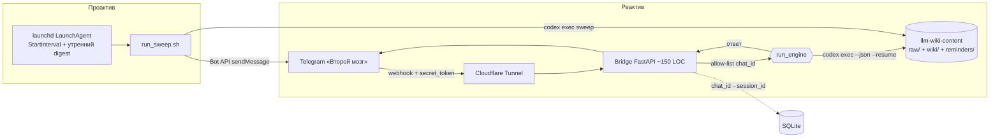

# Исследование — «Второй мозг»

> ⚠️ Этот research выполнен ДО разворота движка. Решение по движку пересмотрено: см. ADR-0008 (Claude-native), заменяет ADR-0001. Раздел оставлен как обоснование/история.

> Сводный отчёт по 7 направлениям исследования, проведённого до начала сборки. Цель — проверить уже зафиксированные решения ([../adr/](../adr/)) внешними источниками 2026 года и собрать конкретику (флаги, лимиты, имена инструментов, подводные камни) для агентов-сборщиков.
>
> Источник-первооснова паттерна — [LLM-Wiki Карпатого](https://gist.github.com/karpathy/442a6bf555914893e9891c11519de94f). Прямой прообраз реализации — корпоративный `abcage-wiki` (тот же автор) и план `pachca-codex-bridge-plan`. Контекст и инварианты проекта — [../../CONTEXT.md](../../CONTEXT.md).
>
> Детальные разборы по направлениям — отдельными страницами (см. §«Направления» ниже). Эта страница — синтез: что подтвердилось, что предлагается уточнить, рекомендуемая архитектура.

## Executive summary

Исследование **подтверждает все шесть зафиксированных ADR** и не выявило причин их менять. По каждому направлению нашлись конкретные источники 2026 года, усиливающие выбранный путь:

1. **Движок (ADR-0001).** `codex exec` — зрелая headless-точка входа: `--json` даёт поток JSONL-событий, `resume <SESSION_ID>` — непрерывность диалога, под ChatGPT-подпиской запросы идут через `chatgpt.com/backend-api/codex/responses` и считаются против rolling-окон 5ч/неделя — **`$0` сверх подписки**, ровно как в ADR-0001. Главный архитектурный вывод: **спавнить один короткоживущий процесс на задачу**, не держать резидентный демон (обходит баг живой сессии #17041).
2. **Память (ADR-0002).** Паттерн Карпатого (markdown-вики, `index.md`-навигация, **без embedder**) — верный дефолт для одного пользователя на корпусе в сотни страниц. Сам Карпатый называет порог «~100 источников / сотни страниц», где векторный RAG не нужен. Эмпирический потолок, где паттерн начинает проседать, — **~50–100K токенов / ~100–200 источников**; до него — нулевая поисковая инфраструктура. Опциональный поздний слой — **лексический SQLite FTS5/BM25**, не вектора (ровно trip-wire из ADR-0002).
3. **Telegram (ADR-0004).** Bot API (не userbot) — правильный выбор: webhook за тем же Cloudflare Tunnel, безопасность тремя слоями (`secret_token` + allow-list на `chat_id` владельца + секретный путь). Ограничение «бот не может первым написать» **не мешает** проактиву: владелец один раз шлёт `/start`, мост запоминает `chat_id`, дальше шлём пуши вечно.
4. **Проактив/планировщик (ADR-0004/0005).** На macOS правильный планировщик — **launchd (LaunchAgent), не cron**: при пробуждении из сна launchd запускает пропущенную задачу один раз (cron молча пропускает слот). launchd **коалесцирует** пропущенные интервалы в одно событие — поэтому верная архитектура — **идемпотентный «sweep»**, который читает все due-напоминания и шлёт один digest, а не таймер на каждое напоминание.
5. **Ингест данных (OQ-1).** Порядок Telegram → YouTube → X → VK → WhatsApp подтверждён. Telegram JSON-экспорт — лучший первый источник (парсить `text_entities`, не полиморфное `text`). graphify (кодовые базы) — параллельный трек, **минующий sanitizer** (код — не PII).
6. **Приватность (ADR-0003).** Самый недооценённый риск — **не утечка в публичный репо, а сам движок**: Codex под потребительским ChatGPT-аккаунтом по умолчанию обучается на контенте, ~30 дней retention даже после opt-out. Первый guardrail — ручной шаг в `setup/SETUP.md`: **выключить «Improve the model for everyone»**. Жёсткая граница двух репо (ADR-0003) — главная гарантия «ноль личного в публичном». Система — учебный «lethal trifecta».
7. **Портфолио.** Ниша персональных LLM-wiki в 2026 переполнена, но позиция защитима: **все** аналоги (Khoj, Reor, Basic Memory, obsidian-copilot) — на embeddings; «без embedder, чистый паттерн Карпатого» — реальный дифференциатор. Плюс три уникальных оси: **проактив**, **подписочный движок ($0)**, **Telegram-интерфейс**.

**Предлагается добавить [ADR-0007](../adr/0007-engine-spawn-and-scheduler.md)** — он фиксирует genuinely-новое жёсткое решение, всплывшее в исследовании (паттерн спавна движка + формат reminders + sweep-планировщик + явное принятие риска ToS/prompt-injection). ADR 0001–0006 не трогаются.

## Рекомендуемая архитектура

Для агентов-сборщиков — целевая картина, обоснованная исследованием. Она **не противоречит** ни одному ADR; новые детали — в [ADR-0007](../adr/0007-engine-spawn-and-scheduler.md).

Ключевые принципы, добытые исследованием:

- **Один короткоживущий `codex exec` на задачу**, никогда не резидентный демон. Реактив: `codex exec resume <session_id> --json -a never --cd <wiki_repo>`; первое сообщение чата — без `resume`, ловим `thread.started` для нового `session_id`, кладём в SQLite. Проактив: stateless `codex exec --json -o /tmp/out.json -a never`, можно `--ephemeral`.
- **Движок за абстракцией `run_engine(prompt, session_id|None) -> (answer, new_session_id, usage)`** — один модуль, ~1 функция. Это шов портируемости из ADR-0001: смена на `claude -p` / `opencode run` — это смена адаптера, не переписывание моста.
- **Память — markdown + `index.md`, без embedder.** Поисковая инфраструктура = ноль на старте. Trip-wire: ввести SQLite FTS5/BM25 (не вектора) только когда LLM стабильно мажет мимо страниц или `index.md` > ~40–50K токенов.
- **Планировщик — launchd LaunchAgent с идемпотентным sweep.** `StartInterval` (~30 мин) + `StartCalendarInterval` (утренний digest) + `RunAtLoad`. Дедуп через `status`/`last_fired`, чтобы коалесцированный двойной запуск не задвоил пуш.
- **Sanitizer — в write-path, fail-closed**, два яруса: ярус-1 (секреты, regex + энтропия Шеннона, **блок при детекте**) и ярус-2 (PII через Presidio, **маскируем, но не блокируем** при промахе по именам).
- **Безопасность Telegram** — три слоя; backend закрыт Cloudflare Access; движок без широкого «fetch any URL»-инструмента (минимизация blast radius lethal-trifecta).

## Направления (детальные страницы)

| Направление | Страница | Ключевой вывод |
|---|---|---|
| Движок и headless-runtime | [engine-runtime.md](engine-runtime.md) | `codex exec` + spawn-fresh-per-task; `run_engine()` абстракция; не держать демон |
| Память / архитектура знаний | [memory-architecture.md](memory-architecture.md) | Чистый Карпатый без embedder; trip-wire FTS5 на ~100–200 источниках |
| Telegram-интерфейс | [telegram-interface.md](telegram-interface.md) | Bot API + webhook; 3 слоя защиты; `/start` снимает «бот не пишет первым» |
| Проактив и планирование | [proactive-scheduling.md](proactive-scheduling.md) | launchd, не cron; идемпотентный sweep; reminders как ISO + iCal RRULE |
| Ингест данных и парсеры | [data-ingestion.md](data-ingestion.md) | Telegram first (`text_entities`); stdlib-парсеры; graphify минует sanitizer |
| Приватность и секреты | [privacy-security.md](privacy-security.md) | Движок — главный риск; opt-out; gitleaks pre-commit+CI; lethal trifecta |
| Позиционирование портфолио | [portfolio-positioning.md](portfolio-positioning.md) | «Без embedder» + проактив + $0 — защитимая ниша; честные limitations |

---

## 1. Движок и headless-runtime

**Что подтвердилось.** `codex exec` — headless-точка входа; `--json` печатает поток JSONL (`thread.started`, `turn.started`/`turn.completed{usage}`, `item.*`, `error`); финальный ответ можно забрать через `-o/--output-last-message <path>`, а JSON-Schema-ответ навязать через `--output-schema`. Непрерывность — `codex exec resume <SESSION_ID>` (сессии — JSONL под `~/.codex/sessions/YYYY/MM/DD/`). Под ChatGPT-OAuth (`~/.codex/auth.json`) запросы идут через недокументированный `chatgpt.com/backend-api/codex/responses` и считаются против rolling 5ч + недельного окна — **`$0` сверх подписки**, ровно как в ADR-0001. Лимиты 2026: Plus ≈ 15–80 GPT-5.5-сообщений / 5ч, Pro $200 (20x) — до ~1600 / 5ч; для одного пользователя необязывающе.

**Рекомендации.**
- Реактив: `codex exec resume <session_id> --json --skip-git-repo-check --cd <wiki_repo> -m gpt-5.5 -a never "<msg>"`; первое сообщение чата — без `resume`, парсим `thread.started` → новый `session_id` в SQLite.
- Проактив: stateless `codex exec --json -o /tmp/out.json -a never --cd <wiki_repo> "..."`; здесь `--ephemeral` уместен.
- Поток JSONL читать построчно: действовать на `turn.completed` (брать `usage` для учёта лимитов), всплывать `error`; финальный ответ — через `-o`.
- Каждый спавн обернуть: неблокирующий subprocess, жёсткий timeout (120–240с), single-flight на `chat_id`, один ограниченный retry на transient-`error`.
- Закрепить в `~/.codex/config.toml`: `forced_login_method="chatgpt"` (запереть подписку, не дать молча уйти в API-биллинг), `approval_policy="never"`, `sandbox_mode="workspace-write"` с `writable_roots=["<llm-wiki-content>"]`, `network_access=false`.
- Движок за `run_engine(prompt, session_id|None)` — шов портируемости ADR-0001.

**Портируемость.** `claude -p --output-format json --resume <uuid>` — ближайший аналог 1:1, но два события 2026 ослабляют его как «дешёвый дроп-ин»: блокировка third-party-харнессов от 2026-01-09 и отдельный метеринг «Agent SDK credit» для `claude -p` с 2026-06-15. OpenCode — рабочий fallback (OpenAI официально расширил на него поддержку подписки). Локальный Ollama+Qwen — только stub (хрупкий tool-calling, нужен контекст ≥64K и железо 32B-класса).

Детали — [engine-runtime.md](engine-runtime.md).

## 2. Память / архитектура знаний

**Что подтвердилось.** Паттерн Карпатого — «компилируй один раз в накапливающийся артефакт»: LLM читает источник, обновляет 5–15 entity/concept-страниц, дописывает `log.md`, помечает противоречия **на ингесте** (противоположность RAG, который re-retrieve'ит чанки на каждый запрос). Сам Карпатый отвергает embedder на нашем масштабе: index-first-навигация «работает удивительно хорошо на ~100 источниках / сотнях страниц». Эмпирический порог проседания — **~50–100K токенов / ~100–200 источников** (дальше `index.md` не влезает в контекст + «lost-in-the-middle»). Это конкретный N для trip-wire ADR-0002.

**Сравнение подходов.**

| Подход | Прозрачность / git-diff | Синтез + противоречия | Инфраструктура | Когда выигрывает | Вектора? |
|---|---|---|---|---|---|
| **Markdown LLM-wiki (наш, ADR-0002)** | максимальная | да (на ингесте) | ноль | один юзер, курируемый, ограниченный, audit-first | нет |
| RAG / vec-store (Reor, Khoj) | низкая (чанки) | нет (re-retrieve) | vec-DB + embedder | большой/мультидоменный/high-churn корпус | да |
| Agent-memory (mem0, Letta/MemGPT) | низкая | частично | vec-store / runtime | кросс-сессионные чат-боты / long-horizon агенты | да |
| Basic Memory (ближайший сосед) | высокая (markdown+SQLite) | частично | SQLite + FastEmbed | как наш, но уже **с** гибридным вектором | **да** (перешёл черту) |

**Рекомендации.** Оставить ADR-0002 как есть; в ADR добавить «Evidence»-абзац с порогом ~50–100K токенов и context-rot. Trip-wire сделать **наблюдаемым**: логировать в `log.md` выбранные страницы; триггер — «LLM мажет мимо > X% последних запросов ИЛИ `index.md` > ~40–50K токенов». Поздний слой — **derived, перестраиваемый лексический индекс** (схема memweave `chunks_fts` FTS5/BM25 или `qmd search --json`), markdown остаётся source-of-truth, `.sqlite` — в `.gitignore`. Явно запретить `sqlite-vec`/FastEmbed. Заимствовать **грамматику** Basic Memory (структурные строки observation/relation), но не движок; **не** переходить на `[[wikilinks]]` (это нужно Obsidian-графу, не агенту; ломает house style). Зафиксировать в `compiler/rules.md` два эмпирических провала: (1) агент **регулярно забывает** читать свою вики перед ответом → мандат «читай `index.md`, потом страницу»; (2) error-propagation → периодический lint (read-only-suggest, не автономный bulk-rewrite).

Детали — [memory-architecture.md](memory-architecture.md).

## 3. Telegram-интерфейс

**Что подтвердилось.** Bot API (не userbot/MTProto) — верно для single-owner и уже зафиксировано в ADR-0004. Правило «бот не может начать диалог» **не блокирует** проактив: владелец один раз шлёт `/start`, ловим `chat.id`, пишем в `.env` как `OWNER_CHAT_ID`, дальше планировщик шлёт пуши вечно. Webhook (не long-poll); webhook и `getUpdates` взаимоисключающи. Голосовые приходят как OGG/Opus, скачиваются через `getFile` (cloud-лимит 20MB ≈ 15–20 мин), транскрипция — локальный whisper.cpp + Metal на Apple Silicon (faster-whisper на Mac только CPU). Форварды — first-class через `Message.forward_origin`.

**Сравнение Bot API vs userbot.**

| Критерий | Bot API (выбран, ADR-0004) | Userbot (MTProto/Telethon) |
|---|---|---|
| Логин | bot token, без номера | номер телефона (реальный аккаунт) |
| ToS / риск бана | минимальный | высокий (автоматизация человека) |
| Входящие webhook | да | нет (только polling) |
| Чтение истории «вживую» | нет (только с `/start`) | да |
| Когда оправдан | наш случай | только если нужна live-история / лимиты бота |

**Рекомендации.** Три слоя защиты в мосте: (1) сравнить `X-Telegram-Bot-Api-Secret-Token` через `hmac.compare_digest` с ≥32-символьным `TG_WEBHOOK_SECRET`; (2) жёстко дропать update, где `effective_chat.id != OWNER_CHAT_ID`; (3) bot-token/nonce в пути webhook. `allowed_updates=['message']`, `max_connections=1`. Библиотека: для ~150-LOC моста — **raw httpx** на Bot API (избегает второго event-loop в FastAPI); `aiogram 3.28.2` — задокументированный fallback при нужде в типизированных моделях/FSM. Голос — за feature-flag (OQ-2): `getFile` → `.oga` → whisper.cpp (`small`) → подать транскрипт как обычную заметку; **не** OpenAI Whisper API (ломает $0). UX: голое сообщение = capture, вопрос = Q&A, плюс `/note`/`/q`/`/remind`/`/due`; сразу слать `sendChatAction "typing"` + короткий ack (маскирует латентность 7–20с).

Детали — [telegram-interface.md](telegram-interface.md).

## 4. Проактив и планирование

**Что подтвердилось.** На macOS — **launchd (LaunchAgent), не cron**: man-страница `launchd.plist` явно говорит, что при сне задача `StartInterval`/`StartCalendarInterval` запустится при следующем пробуждении, а cron слот молча пропускает. Критично: launchd **коалесцирует** несколько пропущенных интервалов в одно событие при пробуждении — значит верная архитектура — **идемпотентный sweep** (прочитать все due-напоминания → один digest), а не «один launchd-job на напоминание». launchd ловит сон, но **не** полное выключение (пропущенный слот при power-off не отыграется на загрузке без `RunAtLoad`) — ровно оговорка ADR-0005.

**Рекомендации.**
- v1-планировщик = LaunchAgent с **обоими**: `StartInterval` (1800с = каждые 30 мин, чтобы пробуждение у due-времени триггерило) + `StartCalendarInterval` (утренний digest, напр. Hour 9) + `RunAtLoad=true`.
- Wrapper `run_sweep.sh`: подгрузить `.env`, дешёвый python-предчек «есть ли что due?» (без движка, экономит лимиты), затем `caffeinate -s codex exec --json <sweep-prompt>`, push через Bot API.
- Формат reminders (v1, в `llm-wiki-content/reminders/`): один `reminders.md` как append-only YAML-frontmatter-блоки. Поля: `id`, `title`, `kind` (oneoff|recurring|spaced), `due_at` (ISO 8601 с таймзоной), `rrule` (iCal RRULE, опц.), `nl_source` (исходный текст, для аудита), `status`, `last_fired`, `created`. Для spaced — `box`/`interval_days`/`ease`.
- NL→структура: Codex нормализует на capture-time; детерминированный fallback — `python-dateutil` (`rrulestr`/`rrule`) + `dateparser` (поддерживает ru). `kvh/recurrent` — опционально (stale/parsedatetime), не на критическом пути.
- Idea-resurfacing — лесенка Leitner `[1,3,7,16,35]` дней на записи reminder.
- «Машина спит» — не бороться: catch-up-on-wake + утренний digest. Опц. `pmset repeat wakeorpoweron` (нужен sudo, одна repeat-схема). **Не** держать `caffeinate` 24/7 (батарея).

Детали — [proactive-scheduling.md](proactive-scheduling.md).

## 5. Ингест данных и парсеры

**Что подтвердилось.** Порядок источников (OQ-1) — Telegram → YouTube → X → VK → WhatsApp. Telegram JSON-экспорт `result.json` — лучший первый источник; парсить `text_entities`, **не** полиморфное поле `text`. YouTube Takeout `watch-history.json` — плоский массив; многие записи без `titleUrl` → фильтровать. X-архив `tweets.js` обёрнут в `window.YTD.tweets.part0` (срезать префикс, потом `json.loads`); DM — PII-риск, в карантин. WhatsApp `_chat.txt` имеет форматы iOS vs Android и невидимые LRM/NNBSP → брать поддерживаемый парсер. VK без чистого JSON-экспорта → API предпочтительнее windows-1251 HTML-архива. graphify (PyPI-пакет `graphifyy`) ингестит кодовые базы локально через tree-sitter → `graph.json` — **параллельный трек, минующий sanitizer** (код — не PII).

**Рекомендации.** Stdlib-only парсеры в `ingest`; вендорить парсер только для WhatsApp. Нормализация: immutable `raw/` → markdown с provenance-frontmatter + watermark, всё **за fail-closed sanitizer**. Доказать sanitizer сначала на Telegram. graphify — отдельный код-трек: коммитить `graph.json`, `.gitignore` на `graphify-out`, **никогда** не гнать код через sanitizer.

Детали — [data-ingestion.md](data-ingestion.md).

## 6. Приватность и секреты

**Что подтвердилось.** Доминирующий риск — **движок, не репо**: Codex под потребительским ChatGPT Plus/Pro — это consumer-аккаунт, где контент по умолчанию идёт в обучение и хранится ~30 дней для abuse-мониторинга даже после opt-out; ZDR — только enterprise/API. Цена ($200 Pro) этого не меняет — меняет только **тип** аккаунта. Самая сильная гарантия «ноль личного в публичном» — **жёсткая граница двух репо** (ADR-0003): публичный репо физически не содержит `raw/`/`wiki/`, только код + синтетический пример. Система — учебный **lethal trifecta** (приватные данные + недоверенный ингест + внешняя коммуникация); 100%-защиты от prompt-injection нет.

**Рекомендации.**
- **#1 guardrail — ручной шаг в `setup/SETUP.md` ДО первого ингеста:** ChatGPT → Settings → Data Controls → выключить «Improve the model for everyone». В доках честно: даже после opt-out возможен ~30-дн retention; crown-jewel-секреты (пароли, полные номера карт, гос-ID) в прозу вики не писать — только в `.env`.
- Публичный репо: gitleaks в **обоих** местах — pre-commit-хук (официальный `id`, **не** deprecated `gitleaks protect`) + CI-job (gitleaks-action) на полную историю с fail-on-hit. `.gitleaks.toml` с `[extend] useDefault=true` + кастомные `[[rules]]` под форматы проекта (Telegram bot token `\d{8,10}:[A-Za-z0-9_-]{35}`, OpenAI `sk-...`).
- Sanitizer write-path, fail-closed, два яруса: ярус-1 (секреты, regex + энтропия Шеннона base64≥4.5/hex≥3.0, **abort при детекте**); ярус-2 (PII через Presidio — EMAIL/PHONE/CREDIT_CARD/IBAN/IP/CRYPTO, **маскируем, но не блокируем**; PERSON/LOCATION консервативно, промах **не** прерывает запись).
- FileVault обязателен (проверка `fdesetup status`); `.env`/`*.token`/`*.sqlite` в `.gitignore`; опц. sops+age для приватного репо.
- Движок без широкого «fetch URL»/shell-инструмента; единственный исходящий канал — узкий Telegram-пуш владельцу.

Детали — [privacy-security.md](privacy-security.md).

## 7. Позиционирование портфолио

**Что подтвердилось.** Ниша переполнена, но позиция защитима: **все** крупные аналоги (Khoj, Reor, Basic Memory, obsidian-copilot) — на embeddings, ровно то, что ADR-0002 сознательно отвергает → «без embedder, чистый Карпатый» — реальный citable-дифференциатор. Ещё три оси почти отсутствуют у аналогов: **проактив** (push-напоминания — уникальная ось), **подписочный движок $0** + engine-portable-абстракция (точно в зейтгейст 2026 «cost + anti-lock-in»), **Telegram-нативность**. Сообщество 2026 награждает воспроизводимость и прозрачность, штрафует «AI slop».

**Рекомендации.** README на английском с коротким русским интро. Вести дифференциаторами в порядке: (1) без embedder; (2) проактив; (3) $0-движок; (4) Telegram. Above-the-fold — демо-GIF (Telegram: заметка → git-diff страницы → проактивное напоминание). Архитектура — Mermaid (рендерится на GitHub нативно). Топики (≤20, lowercase-hyphen) по образцу Basic Memory. **Featured-секции:** браузабельная синтетическая пример-вики (с git-историей «агент ведёт вики») + раздел «как гарантируем ноль PII-утечки» (граница двух репо + fail-closed sanitizer) + честные «Non-goals & limitations» (v1 Mac-only, single-user, ToS-серая-зона). Лицензия — решить осознанно (AGPL-3.0 — норма ниши; MIT/Apache — максимум reuse для портфолио).

Детали — [portfolio-positioning.md](portfolio-positioning.md).

---

## Подводные камни (сводно)

Самые опасные ловушки по всем направлениям — собраны здесь, детали на страницах направлений.

- **Резидентный codex-демон — ловушка.** Живой процесс умирает на истечении токена (401, 5 неудачных reconnect) и не подхватывает обновлённый `auth.json` (баг #17041, open). Всегда спавнить свежий процесс на задачу.
- **`--ephemeral` + resume молча форкает новый thread** (#15538) и теряет диалог. Никогда не использовать `--ephemeral` на реактив/resume-пути.
- **Забыть `forced_login_method="chatgpt"`** → Codex может уйти в API-key-биллинг (если в env есть `OPENAI_API_KEY`) и молча тратить per-token — прямое нарушение $0 ADR-0001.
- **Считать платный ChatGPT Plus/Pro приватным.** Это consumer-аккаунт: обучение ON по умолчанию + ~30-дн retention. Opt-out — ручной UI-тогл, который код в репо не навязывает.
- **Считать sanitizer (regex+энтропия) достаточной гарантией для публичного репо.** Энтропия мажет по low-entropy-секретам и пере-редактирует UUID; regex мажет по новым форматам. Гарантия — граница двух репо; sanitizer/gitleaks — бэкстопы.
- **Только локальный pre-commit-хук для публичного репо** — не ставится на clone и обходится `--no-verify`/`SKIP=`. Нужен серверный CI-gate.
- **Президио PERSON блокирует запись в приватном репо** — NER лоссовый; имена маскируем консервативно, но промах **не** прерывает (fail-closed только для секретного яруса).
- **«Один launchd-job на напоминание»** — launchd коалесцирует пропущенные интервалы. Единственная надёжная схема — частый идемпотентный sweep с дедупом по `status`/`last_fired`.
- **launchd ловит сон, но не power-off** — не обещать 24/7-проактив на MacBook (оговорка ADR-0005).
- **Telegram-бот без allow-list на `chat_id`** — username бота фактически публичен, любой может слать ему сообщения и читать пуши. `getUpdates` и webhook взаимоисключающи.
- **Широкий «fetch URL»/shell-инструмент движку** — достраивает lethal trifecta (приватные данные + недоверенный ингест + эксфильтрация); 100%-защиты от prompt-injection нет.
- **Telegram `text` полиморфно** — парсить `text_entities`; UTF-16-офсеты; большой `result.json` OOM'ит наивный `json.load`.
- **WhatsApp невидимые LRM/NNBSP + iOS-vs-Android + локали дат** ломают наивные regex.
- **faster-whisper на Mac — только CPU** (~3× реалтайма) — оставляет ~3× на столе vs whisper.cpp+Metal.
- **Захардкоженные числа лимитов** — лимиты 2026 token/reasoning-based, варьируются; трекать реальный `turn.completed.usage` / `/status`.

## Источники

Агрегированный список процитированных URL по направлениям (полные привязки claim↔источник — на страницах направлений).

**Движок и runtime**
- https://developers.openai.com/codex/noninteractive
- https://developers.openai.com/codex/cli/reference
- https://developers.openai.com/codex/config-reference
- https://developers.openai.com/codex/auth
- https://developers.openai.com/codex/changelog
- https://codex.danielvaughan.com/2026/04/24/codex-subscription-api-programmatic-access-gpt-5-5-chatgpt-plan/
- https://codex.danielvaughan.com/2026/04/01/codex-cli-authentication-flows-credential-management/
- https://allthings.how/codex-token-and-rate-limits-explained-for-chatgpt-plans/
- https://github.com/openai/codex/issues/17041
- https://github.com/openai/codex/issues/15538
- https://github.com/openai/codex/discussions/8338
- https://code.claude.com/docs/en/headless
- https://venturebeat.com/technology/anthropic-cracks-down-on-unauthorized-claude-usage-by-third-party-harnesses
- https://www.theregister.com/2026/02/20/anthropic_clarifies_ban_third_party_claude_access/
- https://opencode.ai/docs/cli/
- https://computingforgeeks.com/opencode-cli-cheat-sheet/
- https://docs.ollama.com/integrations/hermes
- https://github.com/NousResearch/hermes-agent/issues/5867
- https://ollama.com/library/qwen2.5-coder

**Память / архитектура знаний**
- https://gist.github.com/karpathy/442a6bf555914893e9891c11519de94f
- https://www.mindstudio.ai/blog/andrej-karpathy-llm-wiki-knowledge-base-claude-code
- https://atlan.com/know/llm-wiki-vs-rag-knowledge-base/
- https://pub.towardsai.net/andrej-karpathy-killed-rag-or-did-he-the-llm-wiki-pattern-7824d876e790
- https://arxiv.org/abs/2307.03172
- https://www.morphllm.com/context-rot
- https://towardsdatascience.com/memweave-zero-infra-ai-agent-memory-with-markdown-and-sqlite-no-vector-database-required/
- https://github.com/tobi/qmd
- https://alexgarcia.xyz/blog/2024/sqlite-vec-hybrid-search/index.html
- https://agentmarketcap.ai/blog/2026/04/10/agent-memory-vendor-landscape-2026-letta-zep-mem0-langmem
- https://vectorize.io/articles/mem0-vs-letta
- https://github.com/basicmachines-co/basic-memory
- https://github.com/reorproject/reor
- https://github.com/khoj-ai/khoj
- https://tomnguyenit.medium.com/i-built-karpathys-llm-wiki-for-my-day-job-here-s-what-actually-works-0d4ec6d1e433
- https://www.sitepoint.com/ai-agent-memory-guide/

**Telegram-интерфейс**
- https://core.telegram.org/bots/api
- https://core.telegram.org/bots/faq
- https://core.telegram.org/bots/webhooks
- https://community.latenode.com/t/can-a-telegram-bot-initiate-a-message-without-any-user-prompt/5131
- https://nguyenthanhluan.com/en/glossary/secret_token-for-setwebhook-en/
- https://medium.com/@alexander.tyutin/running-a-production-ready-webhook-telegram-bot-on-google-cloud-run-a-security-first-approach-57b589ff8e48
- https://dev.to/techresolve/solved-convert-voice-memos-from-telegram-to-text-using-openai-whisper-api-41al
- https://bigmike.help/en/devops/local-telegram-bot-api-advantages-limitations-of-the-standard-api-and-set-eb4a3b/
- https://www.promptquorum.com/power-local-llm/local-whisper-stt-comparison-2026
- https://github.com/FlyingFathead/whisper-transcriber-telegram-bot
- https://pypi.org/project/aiogram/
- https://github.com/aiogram/aiogram
- https://docs.python-telegram-bot.org/

**Проактив и планирование**
- https://www.manpagez.com/man/5/launchd.plist/
- https://dev.to/arjun_adhikari_4ac4ca1052/cron-not-working-on-mac-how-to-fix-the-macos-sleep-trap-with-launchd-3l4g
- https://developer.apple.com/library/archive/documentation/MacOSX/Conceptual/BPSystemStartup/Chapters/ScheduledJobs.html
- https://developer.apple.com/forums/thread/52369
- https://alvinalexander.com/mac-os-x/launchd-plist-examples-startinterval-startcalendarinterval/
- https://practicalparanoid.com/mac/prevent-sleep-or-screensaver-on-macos-via-launchd/
- https://gist.github.com/dideler/85de4d64f66c1966788c1b2304b9caf1
- https://dev.to/nikola/caffeinate-your-mac-to-prevent-it-from-sleeping-4o7a
- https://www.macos.utah.edu/documentation/administration/pmset.html
- https://dateutil.readthedocs.io/en/stable/rrule.html
- https://pypi.org/project/dateparser/
- https://github.com/kvh/recurrent
- https://github.com/bear/parsedatetime
- https://dev.to/umangsinha12/how-spaced-repetition-actually-works-the-sm-2-algorithm-1ge3
- https://controlaltbackspace.org/spacing-algorithm/
- https://cuflow.ai/blog/leitner-method

**Ингест данных**
- https://core.telegram.org/import-export
- https://raw.githubusercontent.com/GustavoMF31/youtube_history/master/watch-history.json
- https://www.tweetarchivist.com/twitter-archive-format-explained
- https://github.com/Pustur/whatsapp-chat-parser
- https://github.com/zenwarr/vk-dialogue-export
- https://github.com/safishamsi/graphify

**Приватность и секреты**
- https://help.openai.com/en/articles/11369540-using-codex-with-your-chatgpt-plan
- https://help.openai.com/en/articles/5722486-how-your-data-is-used-to-improve-model-performance
- https://www.smithstephen.com/p/your-200month-ai-plan-has-the-same
- https://secureprivacy.ai/blog/gpt-5-training-data-opt-out
- https://github.com/Yelp/detect-secrets
- https://github.com/gitleaks/gitleaks
- https://docs.gitguardian.com/secrets-detection/secrets-detection-engine/detectors/generics/generic_high_entropy_secret
- https://www.d4b.dev/blog/2026-02-01-gitleaks-pre-commit-hook/
- https://github.com/microsoft/presidio
- https://microsoft.github.io/presidio/supported_entities/
- https://simonwillison.net/2025/Jun/16/the-lethal-trifecta/
- https://arxiv.org/pdf/2506.01055
- https://cheatsheetseries.owasp.org/cheatsheets/LLM_Prompt_Injection_Prevention_Cheat_Sheet.html
- https://developers.cloudflare.com/tunnel/
- https://en.wikipedia.org/wiki/FileVault
- https://github.com/getsops/sops
- https://github.com/trufflesecurity/trufflehog

**Позиционирование портфолио**
- https://github.com/logancyang/obsidian-copilot
- https://www.finalroundai.com/articles/github-developer-portfolio
- https://github.com/orangekame3/awesome-terminal-recorder
- https://github.blog/developer-skills/github/include-diagrams-markdown-files-mermaid/
- https://www.awesome-testing.com/2025/09/mermaid-diagrams
- https://docs.github.com/articles/classifying-your-repository-with-topics
- https://dev.to/infrasity-learning/the-ultimate-guide-to-github-seo-for-2025-38kl
- https://github.com/duanyytop/agents-radar/issues/422

## Связанные

- [../../CONTEXT.md](../../CONTEXT.md) · [../adr/](../adr/) · [../adr/0007-engine-spawn-and-scheduler.md](../adr/0007-engine-spawn-and-scheduler.md)
- [engine-runtime.md](engine-runtime.md) · [memory-architecture.md](memory-architecture.md) · [telegram-interface.md](telegram-interface.md) · [proactive-scheduling.md](proactive-scheduling.md) · [data-ingestion.md](data-ingestion.md) · [privacy-security.md](privacy-security.md) · [portfolio-positioning.md](portfolio-positioning.md)
